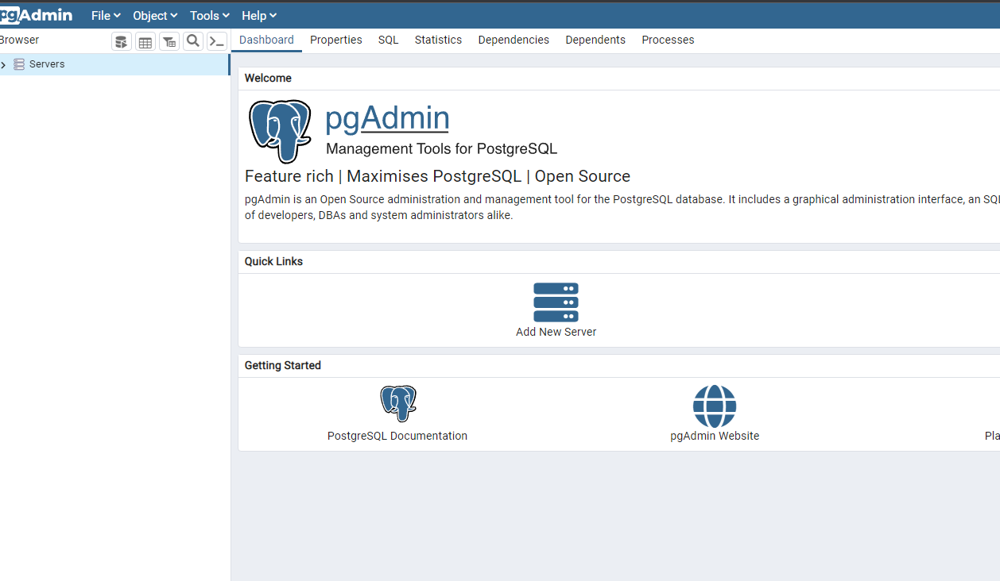
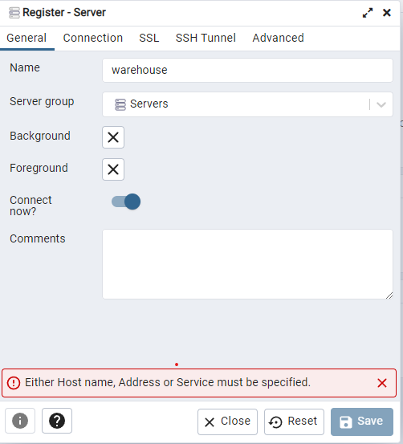
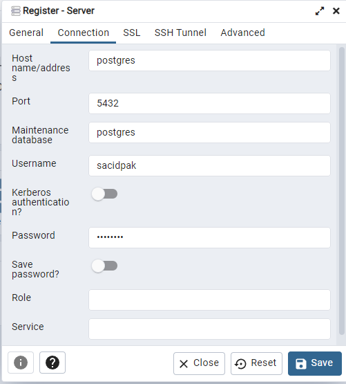

1-"mvn clean install" command run

2- "docker compose up -d" command run

3- open browser and go to localhost:5050

4- set pgadmin password (whatever you want)

5-click add new server

6-set servername (whatever you want)

7-click connection tab and Hostname/address=postgres, username=sacidpak, password=password and click save button

8-Servers right click and select new database from left navbar

9-set database name "order" and click save button

10-repeat new database steps and set database name "product" and click save button

11-run again "docker compose up -d" command 

12-open browser and go to links -> 

    http://localhost:8080/swagger-ui/index.html#/

    http://localhost:8081/swagger-ui/index.html#/

13- Execute this curl

31-1 create product
    
    curl -X 'POST' \
    'http://localhost:8080/api/v1/product' \
    -H 'accept: */*' \
    -H 'Content-Type: application/json' \
    -d '{"name": "FaberCastel",
    "sku": "55.23.22",
    "barcode": "5534",
    "isFrozen": false,
    "price": 100,
    "discount": 10,
    "quantityType": "PIECE"
    }

13-2 create inventory

    curl -X 'POST' \
    'http://localhost:8080/api/v1/inventory' \
    -H 'accept: */*' \
    -H 'Content-Type: application/json' \
    -d '{
    "product": {
    "id": 1,
    "version": 0,
    "name": "FaberCastel"
    },
    "quantity": 100000
    }'

13-3 create order

    curl -X 'POST' \
    'http://localhost:8081/api/v1/order/create' \
    -H 'accept: */*' \
    -H 'Content-Type: application/json' \
    -d '{
    "orderNote": "Apartment 17",
    "customer": {
    "phoneNumber": "5553332211",
    "fullName": "Sacid PAK",
    "addressCode": "55A"
    },
    "orderItems": [
    {
    "barcode": "5534",
    "quantity": 2
    }
    ]
    }'